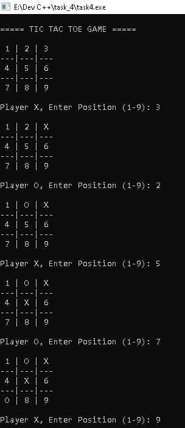
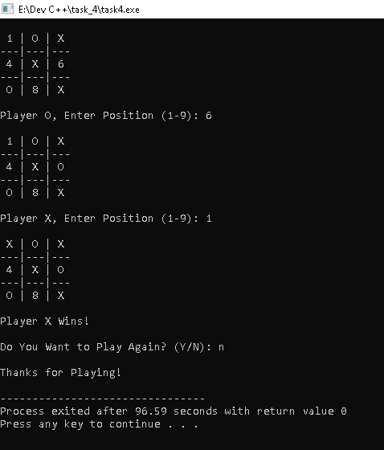

# Tic Tac Toe Game in C++

This project is a console-based Tic Tac Toe game developed using C++.  
It demonstrates core programming concepts such as loops, arrays, functions, and conditional logic through an interactive mini game.

The game allows two players to play Tic Tac Toe with dynamic board updates, win detection, draw detection, and replay functionality.

---

## Features
- Dynamic Game Board
- Two-Player Gameplay
- Win Detection
- Draw Detection
- Replay Option
- Console-Based Interface

---

## Technologies Used
- C++
- Arrays
- Loops
- Conditional Statements
- Functions

---

## How to Run

### Compile
```bash
g++ task4.cpp -o tictactoe
```

### Run
```bash
./tictactoe
```

---

## Game Board Example

```text
 1 | 2 | 3
---|---|---
 4 | 5 | 6
---|---|---
 7 | 8 | 9
```

---

# Output Screenshots

<p align="left">




</p>

## Concepts Used
- Arrays
- Loops
- Functions
- Conditional Statements
- Dynamic Board Display
- Game Logic Implementation

---

## Expected Outcome
An interactive Tic Tac Toe game with dynamic board display, win/loss detection, and replay functionality showcasing effective implementation of game logic.

---

## Author
Farhana N S
